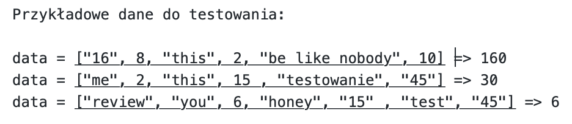

## Zadania na wyrażenia Lambda 

# Zadanie 1

Otwórzcie plik "Zadanie1.js" i wykonajcie polecenia.

# Zadanie 2

Otwórzcie plik "Zadanie2.js" i wykonajcie polecenia.

# Zadanie 3

Napiszcie funkcję w postaci wyrażenia lambda która pobiera jako argumenty zmienne zawierające imię, nazwisko oraz wiek i zwraca (nie wypisuje (!) w konsoli, a tylko zwraca) linjkę tekstu:
 " 'imię' 'nazwisko' ma 'wiek' lat i teraz uczy się programować".
  
Zapiszciecie to wyrażenie w jedną linijkę.

Żeby sprawdić poprawność wykonania możecie wykorzystać "console.log('nazwaFunkcji'('imie', 'nazwisko', 'wiek')" czy co uważacie za najbardziej pasującą postać wypisywania wyniku.
  
# Zadanie 4

Napiszcie funkcję w postaci wyrażenia lambda która pobiera jako argument array (który zawiera elemnty typu integer oraz string), przemnaża wsyztkie elementy typu integer,i zwraca wynik mnożenia. Array musi zawierać chociażbym jedną liczbę, jeżeli liczba tylko jedna, to zwraca jej.

*Podpowiedź: przeczytajcie w dokumentacji o metodzie "typeof".

## Z poważeniem, Sonya
