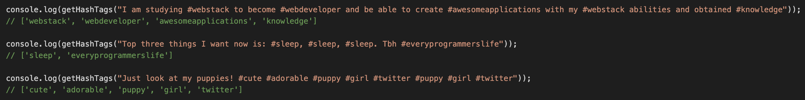
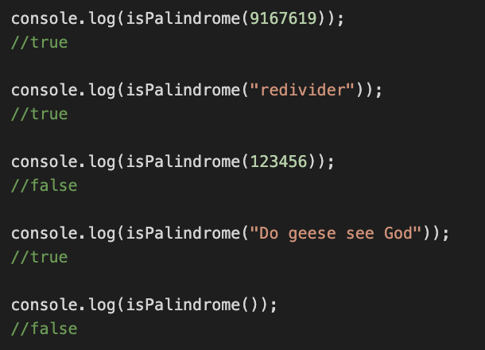

# Wprowadzenie

Wymagana jest znajomość z array'ami, stringami, metodami powiązamyni z nimi oraz funkcjami.
Jeżeli nie czujecie się pewnie z tym, nie róbcie tych zadań, nie są obowiązkowe.

Zapoznajcie się z poniższymi metodami potrzebnymi do wykonania tych zadań:

```
String.split();
String.length;
String.startsWith();
String.slice();
String.includes;
String.toLowerCase();
String.replace();
toString();
Array.push;
```

# Zadanie 1

Napisz funkcję, która wczytuje twit (jeden argument - string) i wypisuje wszystkie wykorzystane w nim hashtagi (w postaci tablicy, bez znaczka # oraz jeżeli hashtag powtarza się, to nie dubluje go).



# Zadanie 2

Napisz funkcję, która wczytuje string lub integer i sprawdza czy argument jest palindromem (czyta się jednakowo z obu stron). Argument może zawierać spacji, duzych liter oraz być pustym (wtedy automatycznie nie jest palindromem).



## Z wyrazami szacunku, Sonya
