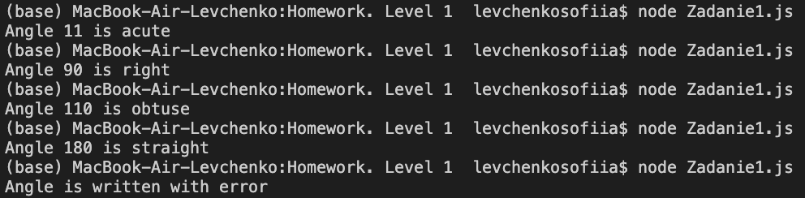
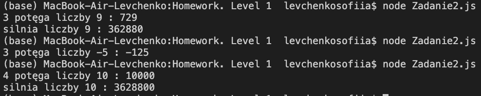
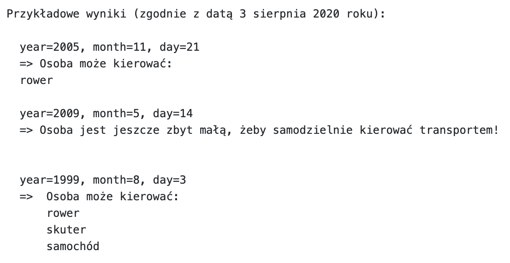
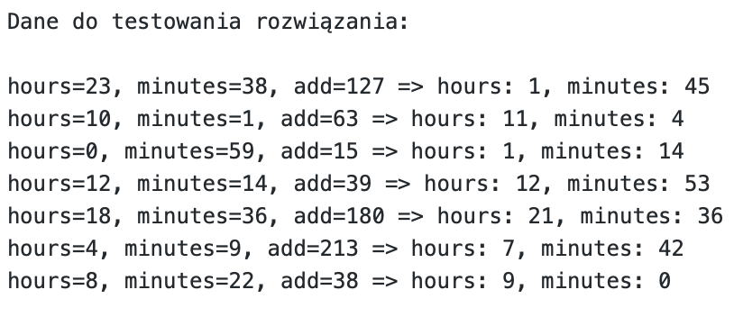

## JEŻELI SIEDZICIE Z ZADANIEM DŁUŻEJ OD 20 MINUT I CZUJECIE, ŻE POTRZEBUJECIE PODPOWIEDZI, TO PISZCIE, PO TO TU I JESTEŚMY!

# Zadanie 1

Napisz program, króry sprawdza typ kąta (dowolny, podany przez was wewnątrz programu) zapisanego w stopniach (jeżeli podany jest nie dodatni kąt lub większy od 180 stopni, to wypisuje komunikat o błędnym zapisie).

# Zadanie 2

Napisz program który wylicza dowolną potęgę dowolnej liczby, silni tej liczby (jeżeli jest dodatnią, trzeba to sprawdzać w programie) oraz wypisuje ich w konsoli.

# Zadanie 3

Napisz program, który sprawdza, czy jest liczba prostą (liczba naturalna większa od jedynki, która ma dokładnie dwa dzielniki naturalne, siebie i jedynkę) na trzy sposoby (korzystając każdy raz z innego rodzaju pętli) lub wypisuje odpowiedni komunikat jeżeli liczba nie jest naturalną (zakładamy, że może być tylko całkowitą). Wynikiem może jako być zwykłe true/false (powtarzane trzy razy) tako i jakiś napis odpowiednio komunikujący, jaka liczba została sprawdzona i czy jest prostą.

# Zadanie 4

Napisz program, w którym będą istnieli 3 zmienne: rok, miesiąc oraz dzień urodzenia osoby, oraz który będzie sprawdzał, czym osoba może samodzielnie kierować: samochodem (od 18 lat), skuterem (od 16 lat), oraz rowerem (od 14 lat), a jeżeli nie może, wypisuje odpowiedni komunikat (coś w stylu "Osoba jest jeszcze zbyt małą, żeby samodzielnie kierować transportem!"). Wiek osoby musi być sprawdzany zgodnie z datą (dowolną), umieścioną w programie jako odpowiednie konstanty.

# Zadanie 5

Napisz program, który dodaje pewną ilość minut do pewnego czasu na "zegarze" oraz wypisuje odpowiedź w konsoli. Masz trzy zmienne: "hours", która mówi o ilości godzin na zegarze, "minutes", która mówi o ilości minut na zegarze, oraz "add" która mówi o ilości minut, które trzeba dodać. 

# Zadanie 6

Jeżeli dotarliście dotąd, gratulację, zrobiliście dobry kawał pracy! Ostatnim zadaniem będzie we wszystkich poprzednich zadanich dodać wykorzystanie funkcji oraz jej wywoływanie (dać do funkcji wszyskie operacje prócz wypisywania do konsoli).

## Z poważeniem, Sonya
