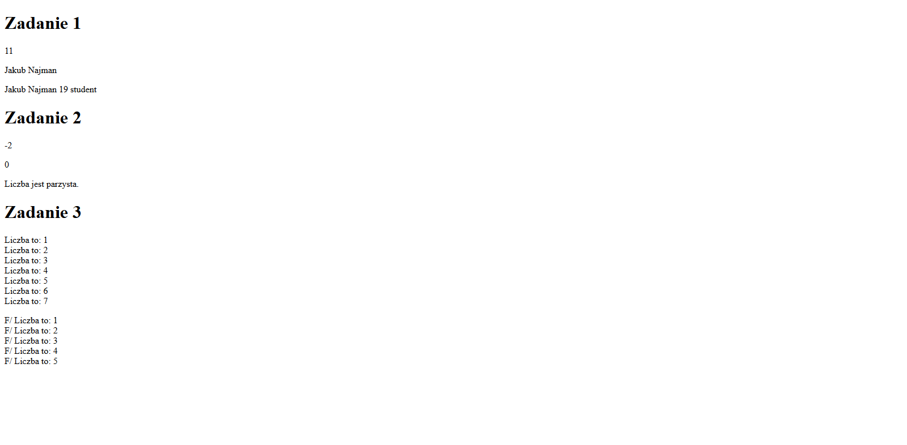

# Java Script - zmienne, obiekty, operatory, funkcje, instrukcje warunkowe, pętla for.

## Zadanie 1

Używając console.log wypisz sumę dodawania dwóch liczb nieujemnych oraz swoje imię i nazwisko.

## Zadanie 2

Napisz funkcję, która pobiera dwie wartości i zwraca ich różnicę. Odpowiednio wypisz w wartość w konsoli używając wywołania funckji. Następnie napisz funkcję, która bada nieparzystość liczby, tj. zwraca "0" kiedy jest parzysta i "1" kiedy jest nieparzysta. Następnie stwórz funkcję, która pobierzę wartość zwróconą z poprzedniej funkcji i zwróci zdanie "Liczba jest parzysta." lub "Liczba jest nieparzysta." w odpowiednim przypadku.

## Zadanie 3

Napisz pętlę, która wypisuję iterację ( lub nadpisuje zmienną ; ) ) po każdym wykonaniu pętli. Póżniej zaimplementuj tę pętlę w funkcję, która będzie pobierała dwie wartości i będą to górna granica iteracji oraz zmienna przechowująca tekst. 

## Zadanie 4
Utwórz obiekt "osoba", której właściwości to: imię, nazwisko, wiek oraz zawód. Przy wypisywaniu użyj metody wywoływania danej własności. Konstrukcja obiketu w JavaScripcie.

```
var objectName = {
    property1:"value1", 
    propert2:"value2", 
    property3:"value3"}
```


