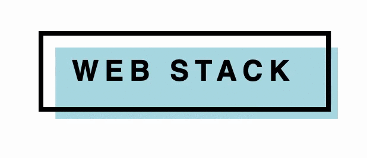

# Ćwiczenia na WebStack'a

Kolejne pomysły ćwiczeń są w osobnych branch'ach.
W razie jakichkolwiek pytań pisać.

ćwiczenie 4 z przyciskiem "Web Stack".

Do zrobienia była wykorzystana wlasność CSS "transition".

## Pozdroo Mati Izbik i Sonya Levchenko
